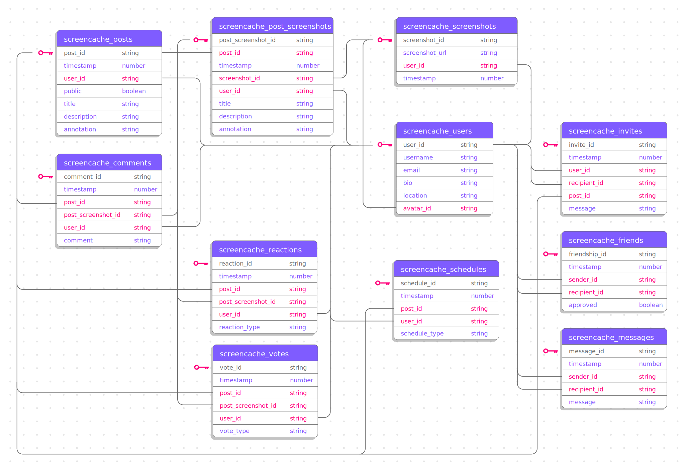

# Architecture

## Domains

Screencache architecture consists of four major domains: API, Uploads, Annotations, and Scheduling.

Users access the application through a mobile app or website frontend. The `api` Lambda serves API requests for all the actions users can perform in the app.

Uploaded images are stored in `uploads` S3 bucket until the `uploads` Lambda goes through the SQS queue of uploads, processes each image (for example by removing geotags), and stores processed images in `screenshots` S3 bucket.

The `annotations` Lambda sends all new images to the Machine Learning system to get automatic annotation of what's in each image.

When users schedule screenshots for *spaced repetition*, the `scheduling` Lambda handles sends out notifications through SNS.

## Infrastructure

|Stack|Service|Scalability|Availability|Pricing|
|-|-|-|-|-|
|Database|DynamoDB|Provisioned or on-demand by region or global (unlimited)|[99.99%](https://aws.amazon.com/dynamodb/sla/)|[DynamoDB pricing](https://aws.amazon.com/dynamodb/pricing/)|
|File Storage|S3|Standard or Infrequent Storage (unlimited)|[99.9%](https://aws.amazon.com/s3/sla/)|[S3 pricing](https://aws.amazon.com/s3/pricing/)|
|Queue|SQS|Automatic elastic scaling (unlimited)|[99.9%](https://aws.amazon.com/messaging/sla/)|[SQS pricing](https://aws.amazon.com/sqs/pricing/)
|Notifications|SNS|Automatic elastic scaling (unlimited)|[99.9%](https://aws.amazon.com/messaging/sla)|[SNS pricing](https://aws.amazon.com/sns/pricing/)
|API|Lambda|Millions of requests|[99.99%](https://aws.amazon.com/lambda/sla/)|[Lambda pricing](https://aws.amazon.com/lambda/pricing/)|
|Logging|CloudWatch|Automatic elastic scaling (unlimited)|[CloudWatch pricing](https://aws.amazon.com/cloudwatch/pricing/)|
|Routing|API Gateway|Millions of requests|[99.99%](https://aws.amazon.com/api-gateway/sla/)|[API Gateway pricing](https://aws.amazon.com/api-gateway/pricing/)|
|Authentication|IAM|Global service (unlimited)|Global|Free
|Authorization|Cognito|[Millions of users](https://docs.aws.amazon.com/cognito/latest/developerguide/limits.html)|[99.9%](https://aws.amazon.com/cognito/sla/)|[Cognito pricing](https://aws.amazon.com/cognito/pricing/)|
|Domain Name|Route 53|Global service (unlimited)|[99.99%](https://aws.amazon.com/route53/sla/)|[Route 53 pricing](https://aws.amazon.com/route53/pricing/)|

### Operations

The approximate cost to operate the application with a small number of users is about `$0.53` per month, split between *Route53* (assuming we have a custom domain name) and *API Gateway* which only has free tier for new AWS accounts.

> The API Gateway cost is pro-rated: for `3000` requests, we would be charged `$0.0350`.

|Service|Free Tier Limits|
|-|-|
|Route53|No free tier, `$0.50` per hosted zone per month|
|API Gateway|`$3.50` per `333 M` of requests (prorated)|
|DynamoDB|`25 GB` storage, `25` read units, `25` write units, `200M` requests|
|S3|`5 GB` storage, `20K` downloads, `2K` uploads, `100 GB` transfer|
|SQS|`1M` requests per month|
|SNS|`1M` mobile push notifications, `1000` emails|
|Lambda|`1M` requests|
|CloudWatch|`10` alarms, `3` dashboards, `5GB` storage|
|Cognito|`50K` user logins|

### Database

Screencache database design reflects a simple social media app with **posts** and one or more **screenshots** in each post.

Users can **comment** on and **react** to posts, add **friends**, **message** them, and **invite** them to see posts.

Since posts may can contain slides or index cards to be memorized with *spaced learning* and *space repetition*, the **schedules** table helps us schedule notifications for these learning sessions.

### Machine Learning

Uploaded images are sent to a language model to generate and attach annotations that describe what's represented in each image.

We evaluated the following models for performing this task. Costs are per million requests.

|Model|Description|Input|Output|
|-|-|-|-|
|[GPT 4 Omni](https://openai.com/index/hello-gpt-4o/)|General purpose|`$5`|`$15`|
|[GPT 4 Omni Mini](https://openai.com/index/gpt-4o-mini-advancing-cost-efficient-intelligence/)|Budget general purpose|`$0.15`|`$0.60`|
|[Gemini](https://ai.google.dev/pricing)|Multimodal, Diverse, repetitive tasks|free|free|
|[Llama](https://www.llama.com/)|Multimodal|free|free|
|[Claude Haiku](https://www.anthropic.com/api)|Small general purpose|`$0.25`|`$1.25`|
|[Claude Sonnet](https://www.anthropic.com/api)|Large general purpose|`$3`|`$15`|
|[DBRX](https://www.databricks.com/blog/introducing-dbrx-new-state-art-open-llm)|Generative|`$0.75`|`$2.25`|
|[Pixtral](https://mistral.ai/technology/#models)|Analyze images|`$0.15`|`$0.15`|
|[Phi Vision](https://azure.microsoft.com/en-us/pricing/details/phi-3/)|Computer vision|`$130`|`$520`|