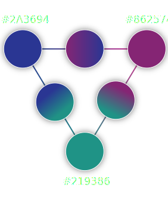

# Screen Cache User Experience

## Design System

Screen Cache mobile app follows Google's [Material Design](https://material.io) standards to achieve a clean, intuitive user interface.

(insert branding image here with iso breakdown of main screens)

## Layout

## Colors

The three main colors chosen to represent Screen Cache are **Blue**, **Magenta** and **Teal**:
* **Blue** represents the freedom of self-expression
* **Magenta** represents creativity and imagination
* **Teal** represents open communication and clarity of thought

The following colors are harmonized and adjusted to meet WCAG 2.0 AAA accessibility requirements:

&nbsp;

&nbsp;

|Color|Name|Hex|
|-|-|-|
||Primary|#2A3694|
||Secondary|#862574|
||Alternate|#219386|
||Background|#303030|
||Header|#212121|
||Foreground|#FFFFFF|
||Danger|#A32361|
||Highlight|#9DBFE5|

## Compositions

UX compositions are designed with [Sketch](https://www.sketch.com/) and exported as images usable by the development team.
